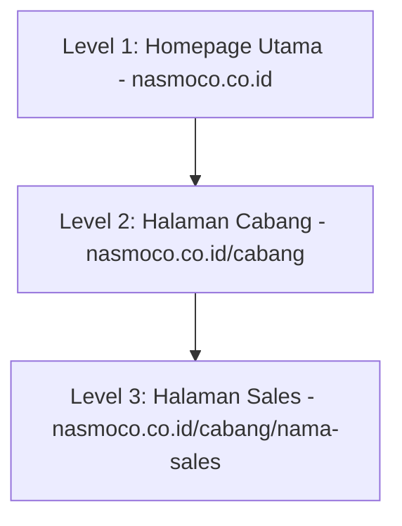

# Ringkasan Poin-Poin Proposal — Platform Website Terpusat Nasmoco

Dokumen ini menyajikan ringkasan eksekutif dan poin-poin penting dari proposal pengembangan **Platform Website Terpusat Nasmoco** yang diajukan oleh **Winamus (PT Winandi Multi Solusi)**. Dokumen ini dirancang untuk memudahkan pemahaman cepat bagi tim manajemen dan teknis Nasmoco.

---

## 1. Latar Belakang & Urgensi Proyek

### A. Kepatuhan Regulasi (Compliance TAM)
*   **SOP TAM Juni 2025:** Toyota-Astra Motor (TAM) mewajibkan seluruh dealer resmi memenuhi standar *Dealer Digital Assets* sebelum **Juni 2026**.
*   **Risiko Non-Compliance:** Kegagalan memenuhi standar ini berisiko mendatangkan teguran tertulis hingga sanksi administratif sesuai dengan *Dealer Agreement*.
*   **Status Audit Nasmoco (Gap Analysis):**
    *   **Sesuai (1 Aspek):** Domain utama (`nasmoco.co.id`).
    *   **Sesuai Sebagian / Partial (1 Aspek):** Konten digital & logo branding.
    *   **Belum Sesuai / Gap (6 Aspek):** Struktur website cabang, website wiraniaga (sales), keamanan MFA, infrastruktur cloud/hosting, monitoring lifecycle asset, dan SOP tata kelola internal.

### B. Tantangan Operasional Saat Ini
1.  **Konsistensi Brand:** Adanya puluhan portal cabang dan wiraniaga yang dikelola mandiri dengan kualitas dan tampilan yang tidak seragam.
2.  **Efisiensi Update:** Pembaruan harga mobil OTR dan promo masih dilakukan secara manual satu per satu di setiap halaman cabang/sales (rawan kesalahan).
3.  **Kebocoran Lead:** Sistem atribusi pesan atau prospek (*leads*) dari pengunjung website ke sales belum terstandarisasi dan berisiko salah sasaran.

---

## 2. Solusi & Arsitektur Platform

Winamus mengusulkan pembangunan platform terpusat dengan **Hierarki Tiga Tingkat** yang dikelola dalam satu sistem manajemen konten (CMS) multi-tenant:

*   **Level 1 (Homepage Utama):** Pintu gerbang informasi nasional, katalog model lengkap, harga OTR terpusat, dan program promo nasional.
*   **Level 2 (Halaman Cabang):** Informasi spesifik cabang, promo lokal, dan harga OTR wilayah yang **sinkron otomatis** dari sistem pusat.
*   **Level 3 (Halaman Sales):** Halaman personal untuk masing-masing wiraniaga dengan komponen terstandarisasi (menjaga konsistensi brand) namun tetap memiliki sentuhan personal (foto, kontak, dan link WhatsApp teratribusi).

### Poin Teknis Kunci:
*   **Single Source of Truth (Harga Tunggal):** Perubahan harga cukup dilakukan sekali di dashboard pusat, dan seluruh halaman cabang serta sales akan terupdate seketika.
*   **Anti-Hijack Lead:** Parameter pelacakan (*tracking*) dan tujuan WhatsApp sales dikunci di sisi server, sehingga tidak dapat dimanipulasi oleh pengunjung dengan mengubah URL parameter.

---

## 3. Tahapan Keamanan & Kepatuhan (Security & Compliance)

Keamanan informasi diterapkan secara bertahap dan terukur untuk meminimalkan risiko keamanan data nasabah sesuai UU PDP:

*   **Fase 1 — Baseline Security:**
    *   Penggunaan basis data PostgreSQL tingkat perusahaan.
    *   Penerapan *Role-Based Access Control* (RBAC) untuk membatasi hak akses user.
    *   Kebijakan password kuat dan fitur *rate limiting* pada form untuk mencegah spam.
*   **Fase 2 — Hardening Security:**
    *   Implementasi *Multi-Factor Authentication* (MFA) wajib untuk seluruh akun admin dan sales.
    *   Integrasi Web Application Firewall (WAF) Cloudflare untuk menangkal serangan DDoS.
    *   Enkripsi data sensitif pelanggan di dalam basis data.
*   **Fase 3 — Security Validation:**
    *   Pelaksanaan *Penetration Testing* (Pen Test) secara mandiri oleh tim internal Nasmoco.
    *   Penyusunan laporan audit kepatuhan (*compliance report*) resmi untuk diserahkan kepada TAM.

---

## 4. Integrasi Sistem Existing

Sistem baru dirancang untuk berintegrasi dan memperkuat sistem yang sudah dimiliki oleh Nasmoco saat ini, bukan menggantikannya:
*   **CRM Integration:** Setiap prospek (*lead*) yang masuk dari form website akan diteruskan secara otomatis via webhook terenkripsi ke CRM internal Nasmoco.
*   **WhatsApp WABA:** Notifikasi dan alur chat tetap menggunakan penyedia WhatsApp Business API (WABA) resmi yang saat ini digunakan oleh Nasmoco.
*   **CDN Media:** Memanfaatkan *Content Delivery Network* yang ada untuk efisiensi penyimpanan gambar dan brosur digital.

---

## 5. Timeline, Biaya & Termin Pembayaran

### A. Jadwal Pengembangan (Total 18 Minggu)
*   **Minggu 1-2 (Fase 0):** Finalisasi Dokumen Spesifikasi & Desain UI/UX.
*   **Minggu 3-8 (Fase 1):** Pengembangan Sistem Inti & **Go-Live MVP (Minggu ke-8)**.
*   **Minggu 9-14 (Fase 2):** Fitur Governance, Approval Workflow, & Pengerasan Keamanan.
*   **Minggu 15-18 (Fase 3):** Optimasi SEO/GEO, Pen Testing Internal, & Laporan Kepatuhan.

### B. Struktur Investasi
1.  **Biaya Pengembangan (Fase 0-3):** **Rp71.100.000** (tidak termasuk biaya Pen Testing)
2.  **Biaya Pemeliharaan (Mulai setelah Fase 1 Go-Live):** **Rp3.600.000/bulan** (mencakup dukungan teknis, hosting awan ISO27001, dan lisensi Cloudflare WAF).
3.  **Total Investasi Tahun Pertama:** **Rp114.300.000** (menggunakan skenario pemeliharaan penuh/Skenario 1)

### C. Termin Pembayaran (Low-Risk Scheme)
Pembayaran dilakukan per fase dengan skema:
*   **30% Down Payment (DP):** Dibayarkan saat fase dimulai sebagai komitmen kerja.
*   **70% Pelunasan:** Dibayarkan hanya setelah *deliverables* pada fase tersebut disetujui oleh tim Nasmoco melalui proses **User Acceptance Test (UAT)**.

---

## 6. Dukungan Operasional & SLA (Service Level Agreement)

Dukungan pasca-peluncuran dikategorikan berdasarkan tingkat kekritisan masalah untuk menjamin kelancaran operasional:

*   **Prioritas Kritis (Sistem Down / Lead Gagal):** Respon $\le$ 2 jam, Resolusi $\le$ 24 jam (Eskalasi langsung ke Project Manager).
*   **Prioritas Tinggi (Fitur Utama Error):** Respon $\le$ 8 jam kerja, Resolusi $\le$ 3 hari kerja.
*   **Prioritas Menengah (Bug Tampilan):** Respon $\le$ 1 hari kerja, Resolusi $\le$ 5 hari kerja.
