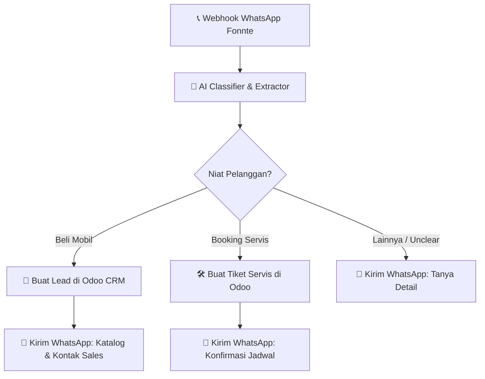

# 📋 Contoh Use Case & Implementasi Flow: Kualifikasi Prospek WhatsApp & Otomasi CRM (Odoo)

Mari kita ambil kasus nyata yang sangat relevan untuk dealer seperti **Nasmoco**: **Sistem Kualifikasi Prospek Otomatis via WhatsApp dan Sinkronisasi ke Odoo CRM.**

---

## 1. Deskripsi Skenario
1. **Trigger:** Pelanggan mengirim pesan WhatsApp ke nomor resmi Nasmoco (diterima via Webhook Fonnte/WABA).
2. **AI Node (Classifier & Extractor):** AI membaca pesan, mengklasifikasi niat pelanggan (apakah mau beli mobil, tanya servis, atau komplain), dan mengekstrak informasi penting (Nama, Model Mobil yang diminati, Lokasi).
3. **Conditional Router:** 
   * Jika ingin **Beli Mobil**, buat prospek (*Lead*) di Odoo CRM, lalu kirim katalog mobil via WhatsApp.
   * Jika ingin **Servis**, buat tiket booking servis di Odoo, lalu kirim jadwal kosong.
   * Jika **Unclear/Umum**, balas WhatsApp dengan ramah meminta detail lebih lanjut.

---

## 2. Diagram Alur (Mermaid)



---

## 3. Representasi JSON (Hasil Ekspor React Flow UI)
Ketika admin merancang alur ini di UI drag-and-drop kita, frontend React Flow akan menghasilkan struktur JSON berikut dan mengirimkannya ke backend FastAPI kita:

```json
{
  "workflow_id": "wf_nasmoco_lead_gen",
  "tenant_id": "nasmoco_jateng",
  "nodes": [
    { "id": "trigger_wa", "type": "webhook_trigger", "config": { "provider": "fonnte" } },
    { "id": "ai_analyzer", "type": "ai_extractor", "config": { "prompt": "Klasifikasikan pesan user menjadi intent: 'beli', 'servis', atau 'lainnya'. Ekstrak nama, tipe_mobil, dan lokasi." } },
    { "id": "router_intent", "type": "conditional_router", "config": { "conditions": [
      { "value": "beli", "target": "create_odoo_lead" },
      { "value": "servis", "target": "create_odoo_service" }
    ], "default": "send_fallback_wa" } },
    { "id": "create_odoo_lead", "type": "action_odoo", "config": { "action": "create_lead" } },
    { "id": "create_odoo_service", "type": "action_odoo", "config": { "action": "create_service_ticket" } },
    { "id": "send_catalog_wa", "type": "action_whatsapp", "config": { "message_template": "Halo {nama}, berikut katalog mobil {tipe_mobil}." } },
    { "id": "send_confirm_servis", "type": "action_whatsapp", "config": { "message_template": "Halo {nama}, booking servis Anda berhasil terdaftar." } },
    { "id": "send_fallback_wa", "type": "action_whatsapp", "config": { "message_template": "Halo, ada yang bisa kami bantu mengenai layanan Nasmoco?" } }
  ],
  "edges": [
    { "source": "trigger_wa", "target": "ai_analyzer" },
    { "source": "ai_analyzer", "target": "router_intent" },
    { "source": "create_odoo_lead", "target": "send_catalog_wa" },
    { "source": "create_odoo_service", "target": "send_confirm_servis" }
  ]
}
```

---

## 4. Implementasi Kode Backend (FastAPI + LangGraph)

Berikut adalah gambaran bagaimana backend Python kita mengompilasi JSON di atas menjadi graf eksekusi LangGraph:

### A. Definisi State & Endpoint Webhook (FastAPI)

```python
# main.py / app/api/webhooks.py
from fastapi import FastAPI, BackgroundTasks, Depends
from pydantic import BaseModel
from app.agents.engine import execute_whatsapp_workflow

app = FastAPI()

class FonnteWebhookPayload(BaseModel):
    sender: str  # Nomor WhatsApp pengirim
    message: str # Pesan teks

@app.post("/api/v1/webhooks/{tenant_id}/fonnte")
async def handle_whatsapp_webhook(
    tenant_id: str, 
    payload: FonnteWebhookPayload, 
    background_tasks: BackgroundTasks
):
    # Jalankan workflow secara asinkron di background agar respons webhook cepat (kurang dari 1 detik)
    background_tasks.add_task(
        execute_whatsapp_workflow,
        tenant_id=tenant_id,
        sender=payload.sender,
        message=payload.message
    )
    return {"status": "accepted"}
```

### B. Logic Graph Engine (LangGraph)

```python
# app/agents/engine.py
from typing import TypedDict, Optional
from langgraph.graph import StateGraph, END
from langchain_google_genai import ChatGoogleGenerativeAI
from pydantic import BaseModel, Field

# 1. Definisikan State global yang mengalir di sepanjang Node
class WorkflowState(TypedDict):
    tenant_id: str
    sender_number: str
    raw_message: str
    
    # Hasil ekstraksi AI
    customer_name: Optional[str]
    car_model: Optional[str]
    intent: str  # 'beli', 'servis', atau 'lainnya'
    
    # Hasil integrasi Odoo
    odoo_lead_id: Optional[str]
    odoo_ticket_id: Optional[str]

# ==========================================
# 2. DEFINISI NODE-NODE (FUNGSI PYTHON)
# ==========================================

# Node A: AI Extractor & Classifier
class CustomerProfiling(BaseModel):
    name: Optional[str] = Field(description="Nama pelanggan jika disebutkan")
    car_model: Optional[str] = Field(description="Tipe/model mobil Toyota yang diminati, misal Avanza, Yaris, Hilux")
    intent: str = Field(description="Klasifikasikan menjadi: 'beli' (tanya harga/unit), 'servis' (tanya jadwal/booking servis), atau 'lainnya'")

def node_ai_profiler(state: WorkflowState):
    llm = ChatGoogleGenerativeAI(model="gemini-2.5-flash")
    structured_llm = llm.with_structured_output(CustomerProfiling)
    
    # AI menganalisis pesan
    prompt = f"Analisis pesan dari pelanggan Toyota berikut:\n\"{state['raw_message']}\""
    result = structured_llm.invoke(prompt)
    
    return {
        "customer_name": result.name or "Pelanggan",
        "car_model": result.car_model,
        "intent": result.intent
    }

# Node B: Integrasi Odoo CRM (Untuk intent 'beli')
def node_create_odoo_lead(state: WorkflowState):
    # Di sini kita memanggil helper API Odoo dengan token dari database vault
    # odoo_client = OdooClient(tenant_id=state["tenant_id"])
    # lead_id = odoo_client.create_lead(name=state["customer_name"], interest=state["car_model"], phone=state["sender_number"])
    lead_id = "ODOO-LEAD-12345" # Mock success response
    return {"odoo_lead_id": lead_id}

# Node C: Integrasi Odoo Service Booking (Untuk intent 'servis')
def node_create_odoo_service(state: WorkflowState):
    ticket_id = "ODOO-TICKET-99999" # Mock success response
    return {"odoo_ticket_id": ticket_id}

# Node D: Balasan WhatsApp (Untuk prospek beli)
def node_send_catalog_wa(state: WorkflowState):
    pesan = f"Halo {state['customer_name']}, terima kasih telah menghubungi Nasmoco. Permintaan katalog {state['car_model']} sedang kami proses. Sales Advisor kami akan segera menghubungi Anda di nomor ini."
    # send_whatsapp_api(state["sender_number"], pesan)
    print(f"[WA OUTGOING to {state['sender_number']}]: {pesan}")
    return {}

# Node E: Balasan WhatsApp (Untuk booking servis)
def node_send_servis_confirm_wa(state: WorkflowState):
    pesan = f"Halo {state['customer_name']}, booking servis Toyota Anda telah terdaftar dengan ID tiket: {state['odoo_ticket_id']}."
    # send_whatsapp_api(state["sender_number"], pesan)
    print(f"[WA OUTGOING to {state['sender_number']}]: {pesan}")
    return {}

# Node F: Balasan WhatsApp Fallback (Unclear intent)
def node_send_fallback_wa(state: WorkflowState):
    pesan = "Halo, terima kasih telah menghubungi Toyota Nasmoco. Ada yang bisa kami bantu? Anda bisa bertanya mengenai daftar harga mobil baru atau melakukan booking servis berkala."
    # send_whatsapp_api(state["sender_number"], pesan)
    return {}

# ==========================================
# 3. ROUTER KONDISIONAL (DECISION NODE)
# ==========================================
def route_intent_decision(state: WorkflowState):
    intent = state["intent"]
    if intent == "beli":
        return "create_lead"
    elif intent == "servis":
        return "create_service"
    else:
        return "fallback"

# ==========================================
# 4. PENYUSUNAN GRAF (COMPILING THE WORKFLOW)
# ==========================================
workflow = StateGraph(WorkflowState)

# Daftarkan semua node
workflow.add_node("ai_profiler", node_ai_profiler)
workflow.add_node("create_lead", node_create_odoo_lead)
workflow.add_node("create_service", node_create_odoo_service)
workflow.add_node("send_catalog", node_send_catalog_wa)
workflow.add_node("send_confirm", node_send_servis_confirm_wa)
workflow.add_node("send_fallback", node_send_fallback_wa)

# Set Entry Point
workflow.set_entry_point("ai_profiler")

# Tambahkan Link/Edge Kondisional
workflow.add_conditional_edges(
    "ai_profiler",
    route_intent_decision,
    {
        "create_lead": "create_lead",
        "create_service": "create_service",
        "fallback": "send_fallback"
    }
)

# Hubungkan aksi ke pengiriman respons WA
workflow.add_edge("create_lead", "send_catalog")
workflow.add_edge("create_service", "send_confirm")

# Hubungkan semua ujung ke END (Selesai)
workflow.add_edge("send_catalog", END)
workflow.add_edge("send_confirm", END)
workflow.add_edge("send_fallback", END)

# Compile Graf
compiled_workflow = workflow.compile()

async def execute_whatsapp_workflow(tenant_id: str, sender: str, message: str):
    # Inisialisasi State Awal
    initial_state = {
        "tenant_id": tenant_id,
        "sender_number": sender,
        "raw_message": message
    }
    # Eksekusi Graf
    await compiled_workflow.ainvoke(initial_state)
```

---

## 5. Mengapa Pendekatan Ini Sangat Unggul?
1. **Efisiensi Finansial:** Langkah Odoo CRM & kirim WhatsApp dijalankan menggunakan **kode Python murni (deterministik)**. Kita hanya mengeluarkan token LLM pada node `ai_profiler` untuk memahami pesan. 
2. **Kestabilan Alur:** Logika pencabangan dari AI Profiler dipetakan dengan kaku lewat `route_intent_decision`. Tidak ada risiko AI "berhalusinasi" mengambil rute yang salah karena rutenya ditulis dalam logika percabangan Python yang baku.
3. **Multi-Tenancy Siap Pakai:** Helper `create_lead` dan `send_whatsapp_api` menerima parameter `tenant_id` untuk mengambil API token WhatsApp dan kredensial Odoo yang benar dari database PostgreSQL multi-tenant kita.
